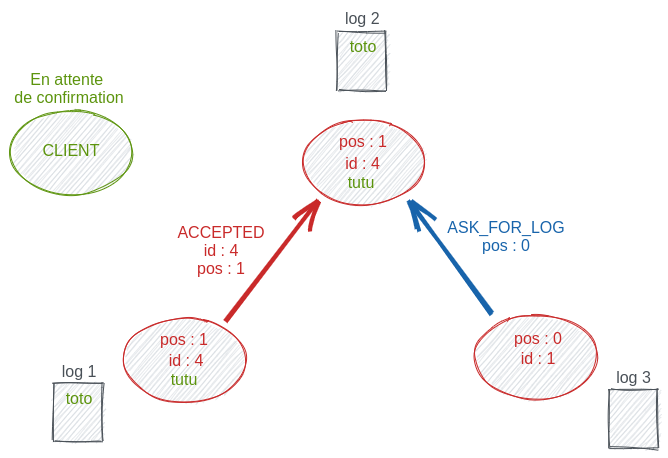

\newpage

# Introduction

Ce projet s'inscrit dans l'évaluation du cours d'*Algorithmique Répartie* en
dernière année à EPITA. Nous devons, à l'aide de MPI, écrire un programme
simulant un ensemble de serveurs devant se mettre d'accord avant d'écrire dans
leur log un message envoyé par un client. Une fois tous les messages envoyés et
traités par les serveurs, ils doivent tous avoir le même fichier de log. De
plus, les serveurs doivent être tolérants à l'injection de fautes dans le
système. Afin de répondre à ces problématique nous avons choisi de baser notre
solution sur l'algorithme *Paxos*.

# Architecture

## Pré-requis

*jq* doit être installé sur le système.

Pour installer les paquets python nécessaires :

```shell
$ make env
```

## Exécution

```shell
$ make config=<configfile>
```

Le lancement de `make` sans préciser le fichier de configuration lance la
configuration par défaut `config/basic.yaml` en vérifiant que l'env python
est bien présent pour l'activer.

Si l'utilisateur ne souhaite pas passer par la REPL mais que les commandes
soient automatiquement lancées il faut préciser les commandes à lancer dans
le yaml de config sous la clé `repl`. Au contraire, si l'utilisateur veut
passer directement il ne faut pas que cette clé apparaisse dans le yaml de
config. Pour plus d'informations par rapport à cette feature, regarder la
section `Configuration`.

## Testsuite

```shell
$ make test 
```

# Paxos

Nous allons dans cette partie reprendre rapidement le fonctionnement de
l'algorithme de *Paxos* et itérer petit à petit jusqu'à arriver sur l'algorithme
que nous avons utilisé pour ce projet.

Nous avons un certain nombre N de serveur, chacun possédant son propre fichier
de log. Un client va envoyer à un des serveurs, peu importe lequel, un message
(e.g: transaction), et chaque serveur doit l'écrire à la même position dans son
log que tous les autres serveurs.

{ height=300px }

Le serveur ayant reçu le message va alors envoyer à tous les serveurs un message
leur demandant s'ils seraient disponibles pour une écriture dans leur log. Nous
allons appeler ``PREPARE`` la requête qu'il envoie dans ce but. Dans le corps de
la requête le serveur envoie un *id* qui doit être unique et ne faire
qu'augmenter (dans paxos l'id considéré est toujours le plus haut).

{ height=300px }

Quand un serveur reçoit un ``PREPARE``, il va comparer l'*id* du message avec le
dernier *id* qu'il a déjà validé. Si celui-ci est supérieur alors il accepte le
message, sauvegarde le nouvel *id*, et répond favorablement au serveur qui a
envoyé le ``PREPARE``. Nous allons appeler cette réponse ``PROMISE``, elle
signifie que le serveur est prêt à recevoir une nouvelle entrée dans son log.

{ height=300px }

Si le serveur ayant envoyé les ``PREPARE`` à tous les serveurs recoit une
majorité de ``PROMISE`` alors une majorité de serveur est dans de bonnes
conditions et sont prêts à recevoir une nouvelle entrée. Il envoie donc la
valeur à inscrire dans un message que nous allons appeler ``ACCEPT``. Il va
également envoyer l'*id* qu'il avait choisi au début, à la réception du message
du client.

{ height=300px }

À la réception d'un ``ACCEPT`` un serveur va vérifier que l'id correspond bien à
l'*id* du message auquel il avait répondu par ``PROMISE`` quelques instants plus
tôt. Si les deux sont bien identiques alors il sauvegarde la valeur dans le
message et envoie une confirmation au serveur émetteur. On appellera cette
confirmation ``ACCEPTED``.

{ height=300px }

Si le serveur ayant envoyé les ``ACCEPT`` à tous les serveurs reçoit une
majorité de ``ACCEPTED`` alors une majorité de serveur a reçu la valeur et est
prête à l'inscrire dans son log. Il va envoyer à tous les serveurs un message
disant d'inscrire la dernière valeure qu'ils ont sauvegardé avec l'*id* courant
dans leur log. Ce message sera appelé ``DECIDE``. Le serveur va également
envoyer une confirmation au client afin qu'il sache que la valeur qu'il voulait
transmettre a bien été écrite dans le log d'une majorité de serveurs.

{ height=300px }

À la réception d'un ``DECIDE``, si l'*id* est identique, les serveurs écrivent
la valeur sauvegardée dans leur log.

Voilà un *Paxos* très simple afin que tous les serveurs écrivent une valeur
reçue d'un client dans leur log. Un *Multi-Paxos* est simplement ce même
déroulement, effectué plusieurs fois avec quelques problématiques
supplémentaires. Avant de nous y intéresser, nous allons voir la gestion de
certains cas d'erreur dans notre premier algorithme.

Le premier est implémenté du côté du client. Si un client ne reçoit pas la
confirmation que la valeur qu'il a envoyée a bien été enregistrée par le serveur
alors, après un laps de temps assez long, il va simplement renvoyer le message à
un autre serveur. Le choix est aléatoire afin de ne pas rester bloqué en cas
d'indisponibilité d'un des serveurs.

Replongeons nous dans les étapes précédentes et imaginons qu'un nouveau client
envoie un message à un serveur alors que le premier serveur venait de recevoir
une majorité de ``PROMISE``.

{ height=300px }

Le serveur venant de recevoir ce message va alors prendre un *id* supérieur au
précédent et va envoyer les ``PREPARE`` dont nous avons parlé précédemment.
L'*id* étant supérieur, les serveurs vont l'accepter, répondre ``PROMISE``, et
sauvegarder ce nouvel *id*. Le serveur qui avait reçu le message du premier
client va lui envoyer un message lui indiquant que sa valeur n'a pas pu être
notée dans le log. Il ne sert effectivement à rien d'envoyer des ``ACCEPT`` avec
un *id* inférieur, les autres serveurs les ignoreraient et ne répondraient pas.

{ height=300px }

Mais que se passe-t-il si le client décide de renvoyer directement son message à
un serveur ? L'*id* est supérieur, il est accepté par les autres serveurs, et
nous recommençons. Nous arrivons ici dans un cas de **deadlock**. Pour le
résoudre nous allons demander au client d'attendre *X* secondes avant de
renvoyer son message à un serveur. Si le client reçoit à nouveau un autre 503 de
la part d'un serveur alors ce temps d'attente va augmenter exponentiellement. Le
but étant de laisser suffisamment de temps aux serveurs pour finir totalement un
round.

# Multi - Paxos

Chaque client possède maintenant une liste de valeurs à transmettre aux
serveurs. Une fois qu'ils ont la confirmation qu'une valeur a été acceptée ils
envoient la suivante, jusqu'à avoir obtenu une confirmation pour chaque valeur :
nous avons alors une réplication de log simple, sans aucune gestion
d'erreurs.

Dans notre implémentation l'*id* que nous utilisons est le timestamp auquel un
serveur reçoit un message de la part d'un client. De cette façon l'*id* est
(presque) toujours unique et s'incrémente continuellement.

# Configuration

Il était demandé de pouvoir indiquer un fichier dans lequel un client pourrait
lire les messages à envoyer. Nous avons opté pour un unique fichier de
configuration YAML global reprenant toutes les informations nécessaires à notre
programme.

Les champs obligatoires :

- *servers* : un int qui correspond aux nombres de serveurs
- *clients* : une liste avec la configuration de chaque client, un client est un
  objet qui comporte deux champs :
    - *client* : un entier compris entre *0* et *n*, c'est l'id du client
    - *msg* : la liste de tous les messages que ce client devra envoyer.

Et optionnellement :

- *repl* : une liste de commande qui seront passées à la *REPL* une fois le
  programme initialisé. Un cas d'utilisation simple est le *START* *EXIT*
  (visible sur la capture d'écran ci dessous) qui permet de lancer le programme
  et d'en sortir sans être interrompu par l'io avec la *REPL* (utile dans le cas
  de la testsuite par exemple). On peut imaginer plein de scénarios avec cette
  commande afin de diversifier les tests. L'ajout un sleep entre l'envoi de deux
  commandes serait une bonne amélioration si l'on devait retravailler sur le
  projet.

```yaml
servers: 2
repl:
  - 'START'
  - 'EXIT'
clients:
  - client: 0
    msg:
      - 0
  - client: 1
    msg:
      - 1
```

Si l'utilisateur souhaite lancer `mpiexec` à la main, il faut faire
attention dans l'addition du nombre de process à ne pas oublier celui pour la
*REPL* (process = servers + clients + 1).

# REPL

La *REPL* est dans notre cas simplement un thread supplémentaire de **MPI** qui
interagit via ``stdin`` et ``stdout`` avec l'utilisateur, et qui peut envoyer
des signaux aux différents serveurs et clients. Une fois les clients et les
serveurs initialisés, elle affiche l'état courant et c'est à l'utilisateur de
dire aux clients qu'ils peuvent commencer à envoyer leurs messages. Elle peut
gérer plusieurs commandes qui sont elles aussi listées ci-dessous.

{ height=400px }

Voici l'affichage dans le cas du *basic.yaml* que nous avons vu au dessus (sans
la clé ``repl``) :

{ height=300px }

# Speed

La boucle au niveau de chaque serveur est très simple : tant que nous n'avons
pas dans notre log tous les messages que nous devrions avoir on ``Iprobe``. Si
on doit recevoir une valeur, en fonction du tag on redirige sur la bonne
fonction qui se chargera de ``recv`` et d'agir en conséquence. On sleep ensuite
pour une durée de *X* secondes. Chaque serveur est initialisé avec 1 pour valeur
(soit `HIGH`). La repl en envoyant des messages `SPEED LOW|MEDIUM|HIGH` va
passer ce temps d'attente ou durée du tick de chaque serveur à respectivement 3,
2 ou 1 secondes.

# Crash - Recovery

Nous allons maintenant introduire une nouvelle valeur que portera chaque
serveur: la position actuelle dans le log. Cette valeur sera transmise dans
chaque message et donnera lieu à une nouvelle comparaison. Chaque serveur à la
réception d'un message comparera non seulement l'*id* du message mais également
les positions dans le log. Si jamais un serveur a reboot ou était indisponible
pendant un laps de temps donné alors il y a deux cas :

Dans notre premier cas un serveur après une période d'absence reçoit un message
d'un autre serveur avec un position dans le log plus importante que la sienne.

{ height=300px }

L'*id* présent dans le message ``ACCEPT`` ne correspondant dans tous les cas pas
à l'*id* du serveur, le message ne sera pas accepté. Le serveur va
également remarquer que la position dans le log du serveur qui lui a envoyé ce
message est supérieur à la sienne. Il va donc demander à ce serveur les valeurs
comprises entre sa position dans le log et la sienne tout en lui signifiant
qu'il n'est pas en état d'inscrire quelque chose dans son log (concernant le
round en cours). On appellera originalement cette demande de log par
``ASK_FOR_LOG``. Pendant ce temps il n'y a pas eu de soucis pour l'autre serveur
ayant reçu un ``ACCEPT``, il répond normalement.

{ height=300px }

Le serveur ayant reçu le ``ASK_FOR_LOG`` va lire dans son log entre les deux
positions et envoie alors les logs manquants dans un message appelé
``MISSING_LOG``.

{ height=300px }

Le serveur est maintenant à jour dans son log et la suite du programme peut
continuer normalement.

L'autre cas est si un client le contacte directement alors qu'il vient d'être
réintroduit dans le système. Il va alors envoyer un ``PREPARE`` à chaque serveur
avec sa position en retard dans le log.

{ height=300px }

Les autre serveurs, bien que l'*id* soit supérieur et qu'ils devraient donc
renvoyer une ``PROMISE`` à ce serveur et abandonner l'échange en cours ne vont
pas le faire. Ils vont répondre un ``MISSING_LOG``. Le serveur recevant le
``MISSING_LOG`` mettra à jour son log et indiquera au client de renvoyer son
message plus tard.

{ height=300px }

Le serveur est maintenant à jour dans son log et la suite du programme peut
continuer normalement.

Ce système de rattrapage du log manquant après une indisponibilité est ce qui
nous permet de gérer le crash et le recovery d'un serveur. Si la *REPL* envoie
un ``CRASH`` à un serveur, il ne réagira plus à aucun message. Si la *REPL* lui
envoie ``RECOVERY`` il recommencera à réagir et par le procédé décrit au dessus
rentrera dans le système.

# Pytest

Afin d'éviter les régressions et de s'assurer que notre code gérait un maximum
de corner case nous avons fait une testsuite avec ``pytest``. Elle n'est
constituée, malheureusement, que de tests fonctionnels. Le fonctionnement est
assez simple, nous lançons notre programme avec tous les fichiers de
configuration présents dans le dossier *config* et nous comparons les fichiers
de log. Si l'on devait continuer dans ce projet il serait bien d'implémenter des
tests unitaires.

Une vue beaucoup plus détaillée de chaque message ou fonction appelée ainsi que
de chaque action de chaque serveur ou client dans le programme est disponible
dans le fichier `gobal.log`.

# Performances

Les test sont nommés avec le pattern : ``<nb_servers>_<nb_clients>_<nb_messages>``.

## Un message

|       |   PREPARE |   PROMISE |   ACCEPT |   ACCEPTED |   CONFIRMATION |   DECIDE |
|:------|----------:|----------:|---------:|-----------:|---------------:|---------:|
| 1_1_1 |         1 |         1 |        1 |          1 |              1 |        1 |
| 3_1_1 |         3 |         3 |        3 |          3 |              1 |        3 |


## Deux messages

|       |   PREPARE |   PROMISE |   DENIED |   ACCEPT |   ACCEPTED |   CONFIRMATION |   DECIDE |   503 |
|:------|----------:|----------:|---------:|---------:|-----------:|---------------:|---------:|------:|
| 2_2_2 |         6 |         5 |        1 |        4 |          4 |              2 |        4 |     1 |


## Trois messages

|       |   PREPARE |   PROMISE |   ACCEPT |   ACCEPTED |   CONFIRMATION |   DECIDE |   DENIED |   503 |
|:------|----------:|----------:|---------:|-----------:|---------------:|---------:|---------:|------:|
| 1_1_3 |         3 |         3 |        3 |          3 |              3 |        3 |        0 |     0 |
| 3_3_3 |        18 |        15 |       15 |         10 |              3 |        9 |        9 |     3 |


## Neuf messages

|       |   PREPARE |   PROMISE |   ACCEPT |   ACCEPTED |   CONFIRMATION |   DECIDE |   DENIED |   503 |
|:------|----------:|----------:|---------:|-----------:|---------------:|---------:|---------:|------:|
| 1_1_9 |         9 |         9 |        9 |          9 |              9 |        9 |        0 |     0 |
| 3_3_9 |        39 |        35 |       36 |         28 |              9 |       27 |       18 |     8 |


## Seize messages

|          |   PREPARE |   DENIED |   PROMISE |   503 |   ACCEPT |   ACCEPTED |   CONFIRMATION |   DECIDE |
|:---------|----------:|---------:|----------:|------:|---------:|-----------:|---------------:|---------:|
| 12_16_16 |       408 |      211 |       329 |    25 |      276 |        202 |             16 |      192 |


## Analyse

{ height=300px }

Les tests avec un seul message sont là pour avoir une baseline du nombre de
messages nécessaire lorsqu'il n'y a pas de confusions entre les serveurs pour
choisir la valeur a mettre dans le log.

On peut voir avec le graphe et les résultats de notre benchmark que le nombre
de messages par rapport au nombre de requêtes faites par des clients semble
être exponentiel.

Dès que l'on fait des benchmarks sur de très gros exemples comme le test
`12_16_16`, le nombre de messages suit toujours la même exponentielle.
Dans ce genre de cas, les premiers rounds sont assez long, le temps que les
timeouts des clients soient assez élevés pour qu'un round puisse se terminer.
Cela repose la question du back-off exponentiel, où sur les derniers rounds
alors qu'il n'y a plus beaucoup de clients, les temps d'attente sont très
élevés. Une piste d'amélioration pourrait être d'avoir un timeout variable
dans les deux sens en fonction de la charge de requêtes actuelles.


# Conclusion

L'objectif de ce projet était d'implémenter un système de réplication de logs.
Nous devions également être capables de gérer l'injection de fautes dans ce
système et de pouvoir le retrouver un état stable.

Ce projet nous a permis de mettre en pratique et de mieux comprendre tous les
exemples et principes d'algorithmique répartie vus en cours. Il a été apprécié
par l'ensemble du groupe et nous sommes assez contents d'avoir réussi à aller
au bout du projet avec une implémentation d'un multi-paxos fonctionnelle.

Si jamais nous devions continuer ce projet, les points d'amélioration primordiaux
seraient :

- la testsuite
- avoir un back-off auto-adaptif
- optimisation du nombre de messages (suppression des messages `DENIED`)


\newpage

# Références

\begingroup

\renewcommand{\section}[2]{}

\begin{thebibliography}{9}

\bibitem{amberonrails} Amber Fend \textit{PAXOS/MULTI-PAXOS ALGORITHM}.
\url{http://amberonrails.com/paxosmulti-paxos-algorithm/}

\bibitem{stackoverflow} \textit{Why is multi-paxos called multi-paxos}.
\url{https://stackoverflow.com/questions/26589137/why-is-multi-paxos-called-multi-paxos}

\bibitem{beyondthelines} Damien \textit{Multi-Paxos}.
\url{http://www.beyondthelines.net/algorithm/multi-paxos/}

\bibitem{github} Joseph Katsioloudes \textit{Multi-Paxos implementation}.
\url{https://github.com/jkatsioloudes/Multi-Paxos}

\bibitem{microsoft} Microsoft Research \textit{Specification and Verification of
Multi-Paxos}. \url{https://www.youtube.com/watch?v=uBQSE4MMWhY}

\bibitem{google} Google TechTalks \textit{The Paxos Algorithm}.
\url{https://www.youtube.com/watch?v=d7nAGI_NZPk&t=909s}

\bibitem{computerphile} Heidi Howard \textit{Paxos Agreement - Computerphile}.
\url{https://www.youtube.com/watch?v=s8JqcZtvnsM&t}

\end{thebibliography}

\endgroup
